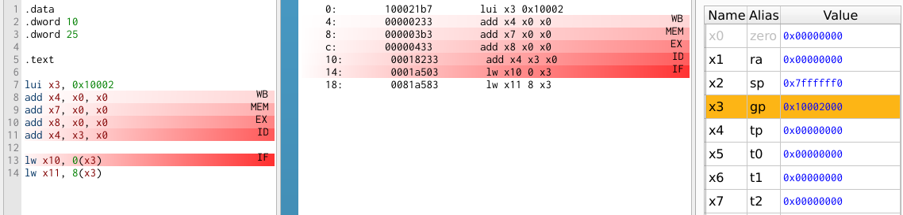
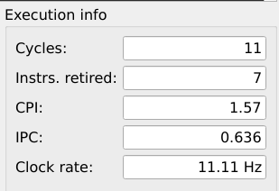
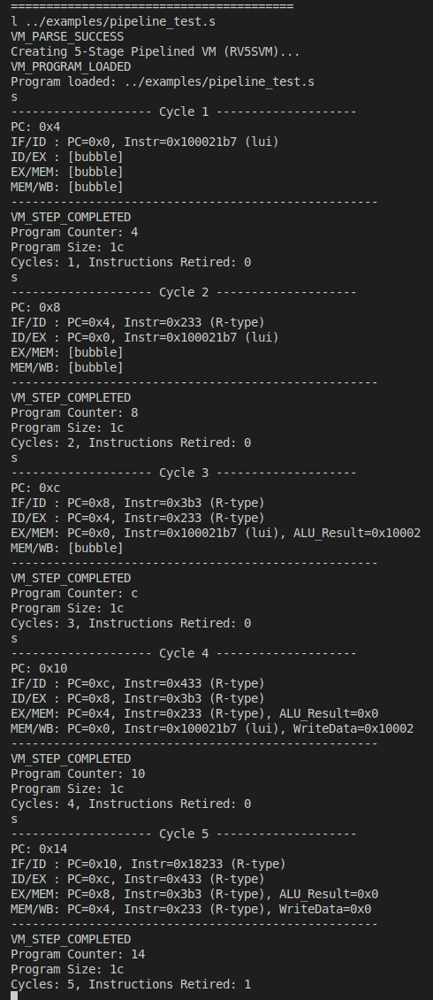
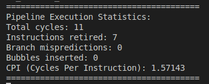
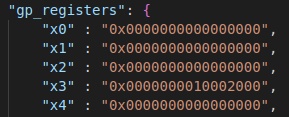

# Progress Report: 5-Stage Pipelined Processor for the RISC-V Simulator

## Team Members
- **Om Dave** (CO22BTECH11006)  
- **Ashutosh Bhatta** (MA22BTECH11007)

---

## Overview

Our project aims to extend the existing in-house single-cycle RISC-V simulator into a **5-stage pipelined processor**.  
We are using the **Ripes simulator** as a reference for all the validation and comparison.

Our primary goals include:
- Implementing a pipeline architecture.
- Supporting both **single-cycle** and **5-stage pipelined** processors with options for **pipelining without data forwarding and hazard detection, pipelining with hazard detection and pipelining with both hazard detection and data forwarding**, as is provided by the ripes simulator.
- Tracking detailed **pipeline statistics**.
- Implementing hazard management mechanisms including **data forwarding**, **hazard detection**, and **branch prediction**.

---

## Current Progress

### Completed Work

1. **Pipeline Implementation**
   - Implemented a **5-stage pipeline** (`IF`, `ID`, `EX`, `MEM`, `WB`).
   - Created the `RV5SVM` class inheriting from `VmBase`.
   - Defined and integrated **pipeline registers** (`IF/ID`, `ID/EX`, `EX/MEM`, `MEM/WB`) to pass data and control signals between stages.
   - Each stage operates as an independent function, running one instruction per cycle.

2. **Execution Flow**
   - The `Step()` method executes stages in reverse order (`WB → MEM → EX → ID → IF`) so that each stage uses the data generated by the previous stage in the previous cycle.

3. **Processor Selection**
   - We have added a configuration option to **switch between single-cycle** and **5-stage pipelined** processors at runtime.

4. **Statistics Tracking**
    
    We have also added metrics for:
     - `CPI` (Cycles Per Instruction)
     - `bubbles_inserted`
     - `branch_mispredictions`
     - `total_cycles`
     - `instructions_retired`

     Since hazard detection and branch prediction are still being implemented, `bubbles_inserted` and `branch_mispredictions` are not being updated as of now. 

5. **Testing and Verification**
   - Created tests for instruction execution. Some tests have also been created to generate data hazards so that once data hazard handling has been added , the results in both the cases can be compared.
   - Verified results against outputs generated by the **Ripes simulator (5 cycles without forwarding and Hazard Detection)** to confirm correctness of execution and state updates.

---


## Challenges Faced

- **Synchronization Between Stages:**  
  Ensuring that pipeline registers correctly propagate data and control signals between dependent stages without overwriting or missing updates.

- **Debugging Without Forwarding:**  
  Without hazard detection or forwarding, the current pipeline can produce incorrect results in dependent instruction sequences, requiring careful tests.

- **Integration with Existing Codebase:**  
  Adapting the existing single-cycle logic to pipelined stages while preserving correctness required significant changes.

---

## Work in Progress

- Refining and validating the **pipeline control logic** under different instruction mixes.
- Expanding test coverage to include memory operations and branch behaviors.

---

## Next Steps / Future Plan

Furhter developments will focus on **hazard management and prediction mechanisms**, specifically:

1. **Hazard Detection Unit**
   - Detect **Read-After-Write (RAW)** and **load-use** dependencies.
   - Introduce logic to **stall** the pipeline and **inject bubbles** when necessary.
   - Track which registers are being read/written by each instruction in the pipeline.

2. **Data Forwarding Unit**
   - Implement **data forwarding paths** from:
     - `EX/MEM` → `EX`
     - `MEM/WB` → `EX`

3. **Branch Prediction**
   - Implement a **predict-not-taken** scheme.
   - Add **pipeline flush** logic on mispredictions.
   - Accurately track and report **branch mispredictions** in the statistics.

4. **Extended Verification**
   - Develop new assembly test programs for:
     - Data hazards
     - Load-use hazards
     - Control hazards (branches and jumps)
   - Cross-verify all results against the **Ripes simulator**.

---

## Overall Progress

| Steps | Objective | Description | Status |
|--------|--------------|-------------|---------|
| Step 1 | Basic 5-stage pipeline | Functional execution of instructions | Completed |
| Step 2 | Statistic tracking | CPI, cycles, bubbles, etc. | Completed |
| Step 3 | Hazard detection & stalling | RAW and load-use hazard handling | In Progress |
| Step 4 | Data forwarding | Bypass logic for faster execution | Pending |
| Step 5 | Branch prediction | Predict-not-taken with flush handling | Pending |
| Step 6 | Full verification | Comparison with Ripes and regression tests | Planned |

---

## Screenshots

<br/>

 

`Output generated by ripes`
 
<br/>

 

--- 



`Processor status and statistics after the execution of 5 cycles`

<br/>

 

---




`Register dump after 5 cycles`

---


<br/>
<br/>
<br/>
<br/>
<br/>
<br/>
<br/>

### PFB our project plan


## **Project Plan: 5-Stage Pipelined Processor for the RISC-V Simulator**

### Members

* Om Dave (CO22BTECH11006)
* Ashutosh Bhatta (MA22BTECH11007)


#### **1. Project Scope**

The goal is to extend the current single-cycle execution model into a 5-stage RISC-V pipeline (IF, ID, EX, MEM, WB).

**In-Scope:**
*   **Pipelined Architecture:** Implement a new VM class, `rv5s_vm` (RISC-V 5-stage Pipelined), inheriting from `VmBase`, to represent the 5-stage pipeline.
*   **Pipeline Registers:** Introduce data structures to act as pipeline registers (IF/ID, ID/EX, EX/MEM, MEM/WB) to hold state between stages.
*   **Data Hazard Handling:**
    *   Implement a **Hazard Detection Unit** to identify Read-After-Write (RAW) data dependencies.
    *   Implement **Data Forwarding** (Bypassing) from the EX/MEM and MEM/WB stages back to the EX stage.
    *   Implement **Pipeline Stalling** (bubble insertion) for load-use hazards where forwarding is insufficient.
*   **Control Hazard Handling:**
    *   Implement a basic **branch prediction** scheme (e.g., predict-not-taken).
    *   On a misprediction, implement **pipeline flushing** to discard incorrectly fetched instructions.
*   **Configuration:** Integrate the new pipelined model into the existing configuration system in `config.h` under the `multi_stage` processor type.
*   **Statistics:** Update VM statistics like `cpi_`, `stall_cycles_`, and `branch_mispredictions_` in `VmBase` to accurately reflect the pipelined execution.

---

#### **2. Implementation Steps**

The implementation will be focusing on building the pipeline structure first, then adding hazard management units.

**Step 1: Create the Pipelined VM Structure**
1.  **Define New VM Class:** Create new files `include/vm/rvmp/rv5s_vm.h` and `src/vm/rvmp/rv5s_vm.cpp`. Define `rv5s_vm` inheriting from `VmBase`.
2.  **Define Pipeline Registers:** In `rv5s_vm.h`, define structs for each pipeline register to pass data and control signals between stages.
    *   `IF_ID_Register`: `instruction`, `pc`
    *   `ID_EX_Register`: `pc`, `rs1_val`, `rs2_val`, `imm`, `rd_addr`, `control_signals` (from `RVSSControlUnit`)
    *   `EX_MEM_Register`: `alu_result`, `rs2_val` (for stores), `rd_addr`, `control_signals`
    *   `MEM_WB_Register`: `memory_result`, `alu_result`, `rd_addr`, `control_signals`
3.  **Adapt Existing Logic:** Refactor the methods from `RVSS` (`Fetch`, `Decode`, `Execute`, `WriteMemory`, `WriteBack`) to operate as individual pipeline stages within `rv5s_vm`. Each stage will read from the previous pipeline register and write to the next.
4.  **Update `Step()` Method and other debugging methods (`DebugRun`, `Undo`, `Redo` etc):** The `Step()` method in `rv5s_vm` will advance the entire pipeline by one clock cycle. This involves executing the stages in reverse order (WB, MEM, EX, ID, IF) to simulate parallel execution and prevent data races on the pipeline registers.

**Step 2: Implement Data Hazard Detection and Forwarding**
1.  **Hazard Detection Unit:** Create a `HazardDetectionUnit` class or a private method within `rv5s_vm`. This unit will be called in the ID stage.
    *   It will check if the source registers (`rs1`, `rs2`) of the instruction in the ID stage match the destination register (`rd`) of instructions currently in the EX or MEM stages.
2.  **Forwarding Unit:** Create a `ForwardingUnit` class or method. This unit will be used in the EX stage.
    *   It will determine if the ALU inputs should come from the register file, the EX/MEM register (`alu_result`), or the MEM/WB register (`memory_result` or `alu_result`).
    *   This involves adding multiplexers (implemented as `if/else` or `switch` logic) to the inputs of the ALU in the `Execute` stage.
3.  **Stalling for Load-Use Hazards:** The `HazardDetectionUnit` will detect if an instruction in the ID stage depends on the result of a `lw`/`ld` instruction in the EX stage.
    *   If a load-use hazard is detected, the unit will signal the pipeline to **stall**.
    *   Stalling will be implemented by:
        *   Preventing the PC and the IF/ID register from being updated.
        *   Injecting a "bubble" (a no-op instruction with control signals cleared) into the ID/EX register.

**Step 3: Implement Control Hazard Handling**
1.  **Branch Logic in ID Stage:** Move branch target address calculation and initial comparison from the EX stage to the ID stage to resolve branches earlier.
2.  **Assume Predict-Not-Taken:** The IF stage will always fetch from `PC + 4`.
3.  **Flush on Misprediction:** When a branch is taken (determined in the ID or EX stage), the instructions that were incorrectly fetched into the IF and ID stages must be flushed.
    *   Flushing will be implemented by replacing the instructions in the IF/ID and ID/EX registers with bubbles.
    *   The Program Counter (`pc_`) will be updated with the correct branch target address.
    *   Increment the `branch_mispredictions_` counter.

---

#### **3. Verification Plan**

Testing will be conducted using custom assembly programs and by extending the existing tests.

1.  **Unit Tests for Hazard Scenarios:** Create new assembly files in the examples directory to specifically test each hazard type.
    *   **Data Hazard Test (`data_hazard_test.s`):**
        ```s
        .text
        addi x5, x0, 5      # x5 = 5
        addi x6, x0, 10     # x6 = 10
        add x7, x5, x6      # RAW on x5, x6. Should produce 15.
        sub x8, x7, x5      # RAW on x7. Should produce 10.
        ```
    *   **Load-Use Hazard Test (`load_use_hazard_test.s`):**
        ```s
        .data
        my_val: .word 42
        .text
        la x5, my_val
        lw x6, 0(x5)        # Load word from memory
        addi x7, x6, 1      # Load-use hazard. Pipeline must stall. Should produce 43.
        ```
    *   **Control Hazard Test (`branch_hazard_test.s`):**
        ```s
        .text
        addi x5, x0, 1
        beq x5, x0, skip    # Branch not taken
        addi x6, x0, 10     # This should execute
        j end
        skip:
        addi x7, x0, 20     # This should be skipped
        end:
        # Final register state should be x6=10, x7=0
        ```
2.  **Integration Tests:**
    *   Modify test_vm.cpp to run existing test programs like `gcd_1.s` using the new `rv5s_vm`.
    *   The final register and memory states should be identical to the results from the `rvss` execution, proving the correctness of the pipelined implementation.
3.  **Debugging and State Dumps:**
    *   Use the `DumpState` function in `VmBase` to dump the state of all pipeline registers at each cycle. This will be crucial for debugging the flow of instructions and control signals.
    *   Use the interactive debugger to step through cycles (`step` command) and inspect pipeline registers.

---

#### **4. Work Partition**

The work will be divided as follow to allow for parallel development.

**Member 1 (Om): Pipeline Core and Data Path**
*   **Tasks:**
    1.  Implement the basic `rv5s_vm` class structure and the pipeline register structs (`rv5s_vm.h`).
    2.  Refactor the `Fetch`, `Decode`, `Execute`, `WriteMemory`, and `WriteBack` methods to work as pipeline stages.
    3.  Implement the `ForwardingUnit` logic within the `Execute` stage to select the correct ALU inputs.

**Member 2 (Ashutosh): Hazard Control and Pipeline Management**
*   **Tasks:**
    1.  Implement the `HazardDetectionUnit` to identify RAW and load-use hazards in the ID stage.
    2.  Implement the logic for stalling the pipeline and injecting bubbles.
    3.  Implement the control hazard logic: flushing the pipeline on mispredicted branches and updating the PC.
    4.  Update the VM statistics (`cpi_`, `stall_cycles_`, etc.) to reflect pipeline behavior