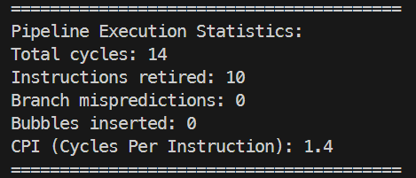
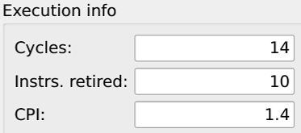
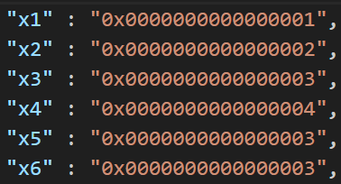
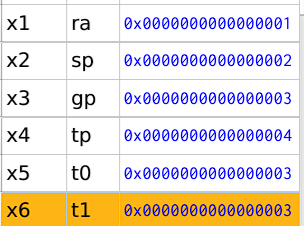
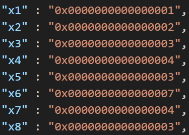
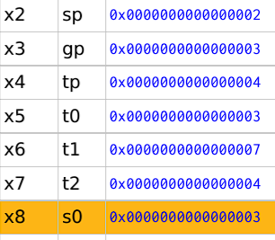
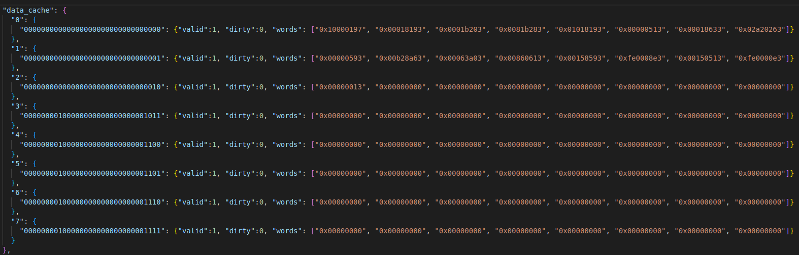

# Final Report: 5-Stage Pipelined RISC-V Processor

**Team Members:**
- Om Dave (CO22BTECH11006)
- Ashutosh Bhatta (MA22BTECH11007)

---

## Summary

This report documents the implementation of a **5-stage pipelined RISC-V processor** as an extension to an existing single-cycle RISC-V simulator. The project implements hazard detection, data forwarding, branch prediction, and complete undo/redo functionality for cycle-level debugging. We use the **Ripes simulator** as a reference for validation and comparison.

**Final Status:** Core pipeline implementation complete with advanced features (forwarding, hazard detection, branch prediction, and undo/redo) along with a functional data cache.

---

## 1. Project Scope and Design Plan

### 1.1 Objectives

Transform the existing single-cycle execution model into a **classic 5-stage RISC-V pipeline** (IF → ID → EX → MEM → WB) with:

1. **Pipelined Architecture** - Full 5-stage pipeline with inter-stage registers
2. **Data Hazard Management** - Detection, forwarding, and stalling mechanisms
3. **Control Hazard Management** - Branch prediction and pipeline flushing
4. **Comprehensive Statistics** - CPI, stall cycles, mispredictions, bubbles
5. **Debugging Support** - Cycle-level undo/redo with complete state restoration
6. **Configuration Flexibility** - Runtime selection of pipeline features

## 2. Implementation Details

### 2.1 Core Pipeline Implementation ✅ **COMPLETED**

#### Pipeline Stage Execution

Each clock cycle executes all 5 stages in **reverse order** to prevent data races:

#### Instruction Fetch (IF)
- Fetches instruction from `program_counter_`
- Writes to `IF/ID` register if not stalled
- Updates PC by +4 (unless branch redirection occurs)

#### Instruction Decode (ID)
- Decodes instruction fields (opcode, rs1, rs2, rd, funct3, funct7)
- Generates control signals via `RVSSControlUnit`
- Reads source registers from register file
- Generates immediate values
- **Hazard detection:** Checks for load-use hazards
- **Branch prediction:** Consults predictor for branch instructions

#### Execute (EX)
- Performs ALU operations
- **Data forwarding:** Applies forwarding from EX/MEM and MEM/WB
- Resolves branch conditions
- Handles special instructions (float, CSR, syscalls)

#### Memory Access (MEM)
- Reads/writes memory for load/store instructions
- Updates branch predictor with actual branch outcome
- Flushes pipeline on branch misprediction

#### Write Back (WB)
- Writes results to register file (GPR/FPR/CSR)
- Records all register changes for undo/redo
- Increments `instructions_retired_`

---

### 2.2 Hazard Detection and Stalling ✅ **COMPLETED**

Detects **Read-After-Write (RAW)** hazards, specifically **load-use** hazards:

**Stalling mechanism:**
- Sets `pc_write_ = false` and `if_id_write_ = false`
- Inserts bubble (NOP) into `ID/EX` register
- Increments `bubbles_inserted_` counter

---

### 2.3 Data Forwarding ✅ **COMPLETED**


### 2.4 Branch Prediction ✅ **COMPLETED**

Supports **three prediction modes**:

1. **No Prediction (mode = 0):** Always predict not-taken
2. **Static Prediction (mode = 1):** Configurable policy (predict-taken or predict-not-taken)
3. **Dynamic Prediction (mode = 2):** 2-bit bimodal predictor with configurable counter bits

**Prediction Flow:**
- **ID Stage:** Get prediction, redirect fetch if predicted taken
- **MEM Stage:** Compare actual outcome with prediction, update predictor
- **Misprediction:** Flush IF and ID stages, increment `branch_mispredictions_`

---

### 2.5 Undo/Redo Functionality ✅ **COMPLETED**

Implements **cycle-level undo/redo** with complete state restoration:

---

### 2.6 Configuration System ✅ **COMPLETED**

**VM Types:**
```cpp
enum class VmTypes {
	SINGLE_STAGE,                      // Original single-cycle VM
	MULTI_STAGE,                       // Basic 5-stage (no forwarding/hazard)
	MULTI_STAGE_WITH_FORWARDING,       // With data forwarding
	MULTI_STAGE_WITH_HAZARD_DETECTION, // With hazard detection
	MULTI_STAGE_WITH_BOTH              // With both forwarding and hazard detection
};
```

**Global Configuration Flags:**
```cpp
namespace globals {
		extern bool pipeline_forwarding_enabled;
		extern bool pipeline_hazard_detection_enabled;
		extern int branch_prediction_mode;
		extern int static_branch_policy;
		extern int branch_prediction_bits;
}
```

---

## 3. Statistics and Metrics

The pipeline tracks comprehensive execution statistics:

| Metric | Description | Implementation |
|--------|-------------|----------------|
| **total_cycles_** | Total clock cycles executed | Incremented in `Step()` |
| **instructions_retired_** | Instructions that completed WB stage | Incremented in `WB()` |
| **bubbles_inserted_** | Pipeline stalls due to hazards | Incremented in `InsertBubble()` |
| **branch_mispredictions_** | Incorrect branch predictions | Incremented in `MEM()` |
| **CPI** | Cycles Per Instruction | `total_cycles_ / instructions_retired_` |

**Sample Output:**
```
========================================
Pipeline Execution Statistics:
Total cycles: 1250
Instructions retired: 1000
Branch mispredictions: 45
Bubbles inserted: 32
CPI (Cycles Per Instruction): 1.25
========================================
```

---

## 4. Testing and Verification

### 4.1 Test Programs

**Pipeline Test (`pipeline_test1.s`):**
```assembly

addi x1, x0, 1        # x1 = 1
addi x2, x0, 2        # x2 = 2
addi x3, x0, 3        # x3 = 3
addi x4, x0, 4        # x4 = 4

add x5, x1, x2       # x5 = 3
add x6, x3, x4       # x6 = 7
sub x7, x6, x5       # x7 = 7 - 3 = 4
and x8, x5, x6       # x8 = 3 & 7 = 3

# End
nop
nop
```


### 4.2 Validation Against Ripes

All test programs verified against **Ripes simulator** outputs:
- Register state after execution
- Memory state
- Cycle count and CPI
- Number of stalls and mispredictions

**Example Comparison:**

#### w/o forwarding or hazard detection 








#### w/o hazard detection





## 5. Challenges Faced

### 5.1 Synchronization Between Pipeline Stages

### 5.2 Undo/Redo Complexity

Pipeline has multiple instructions in-flight; reversing a single cycle affects multiple instructions' states.

So we Implemented comprehensive `StepDelta` structure that captures:
- Complete snapshots of all 4 pipeline registers (before and after)
- All architectural register changes
- All memory changes
- Branch predictor state snapshot

### 5.3 Branch Misprediction Handling

When a branch is mispredicted, wrong-path instructions may have already modified pipeline state.

**Solution:** 
- Prediction made in ID stage
- Resolution in MEM stage
- Flush IF and ID stages on misprediction (no architectural changes yet)
- Track `predicted_taken` flag through pipeline

---

## 6. Additional Feature - Cache Implementation

We added a configurable, basic set-associative cache to the simulator. The cache implementation is in `include/vm/cache/cache.h` and `src/vm/cache/cache.cpp`. It is integrated with the `MemoryController` (see `include/vm/memory_controller.h`) and can be enabled at runtime via the configuration flags in `config.h`.

High-level design
- Type: set-associative cache with configurable associativity and line size.
- Stored per-line metadata: `CacheLine` (state, tag, data vector of bytes).
- Per-set container: `CacheSet` holds `associativity` and a vector of `CacheLine`.
- Policies: replacement (LRU/FIFO/Random enum available, although only LRU has been implemented), write-hit (WriteThrough / WriteBack), write-miss (NoWriteAllocate / WriteAllocate).

Configuration
- `CacheConfig` (in `cache.h`) contains: `size` (bytes), `lines`, `associativity`, `words_per_line`, `replacement_policy`, `cache_type` (Instruction/Data), `write_hit_policy`, `write_miss_policy`.
- The `MemoryController` constructs a `cache::Cache` instance from `vm_config::config` when the first memory access happens and `cache_enabled` is true. Config fields used are `cache_capacity`, `cache_block_size` and `cache_associativity`.

Address mapping and bookkeeping
- Line size (`line_size_`) is derived from the config (either `size / lines` or `words_per_line * 4`).
- `addressToTag(address)` returns `address / line_size_` (integer tag).
- `addressToSetIndex(address)` returns `(address / line_size_) % set_count_` where `set_count_ = total_lines / associativity`.


Replacement & eviction
- Replacement is implemented by keeping the most-recently-used line at the front of the vector and rotating on accesses; the victim is chosen as the last element when no Invalid line exists. Dirty victims are written back (byte-by-byte) before being overwritten.

Statistics
- `CacheStats` collects `accesses`, `hits`, `misses`. There is a `PrintStats()` helper to log these numbers.

Integration with the VM
- The `MemoryController` routes `ReadByte` and `WriteByte` through the cache when enabled. It constructs a `cache::Cache` using values from `vm_config::config` (capacity, block size, associativity) so cache creation is deferred until memory is used.

Dump/Debug output
- `DumpCache` (in `src/utils.cpp`) was updated to produce JSON-formatted dumps under `vm_state/cache_dump.json`. The structure is:

```
{
	"data_cache": {
		"<set_index>": {
			"<line_index>": { "valid": 0|1, "dirty": 0|1, "words": ["0xdeadbeef", "0x01234567", ...] }
			...
		},
		...
	},
	"instruction_cache": { /* empty unless dumping an instruction cache */ }
}
```

This output converts line bytes into 32-bit hex words readability and includes both valid and dirty bits.

Files of interest (implementation):
- `include/vm/cache/cache.h` — types and public API (Cache, CacheSet, CacheLine, CacheConfig, enums)
- `src/vm/cache/cache.cpp` — implementation of ReadByte, WriteByte, fetchLineToSet, address mapping and eviction
- `include/vm/memory_controller.h` — cache construction and routing of Read/Write operations
- `src/utils.cpp` — `DumpCache()` JSON output

Testing
- The cache was tested by existing homeworks and class tests and pipeline tests; statistics (`PrintStats`) and `vm_state/cache_dump.json` were used to validate hits/misses and that write-back correctly flushed dirty lines to memory.

Known limitations & future improvements
- Replacement policy enum supports LRU/FIFO/Random but current code only uses a LRU scheme.
- Error detection for misconfigured cache parameters (e.g., associativity larger than number of lines, block size being divisible by the word size(4)) is not implemented.
- The existing memory read operation reads and writes one byte at a time, which is inefficient for cache line fills and write-backs, and also reflects in the stats. Future improvements could include implementing block read/write operations to optimize performance.
- The stats will be different from other simulators that implement block read/writes for cache operations and also because we have integrated cache write operations with the existing byte-wise memory interface, which does not distinguish between data cache and instruction cache operations. Testing has been done by observing the cache dump after running various test programs.




